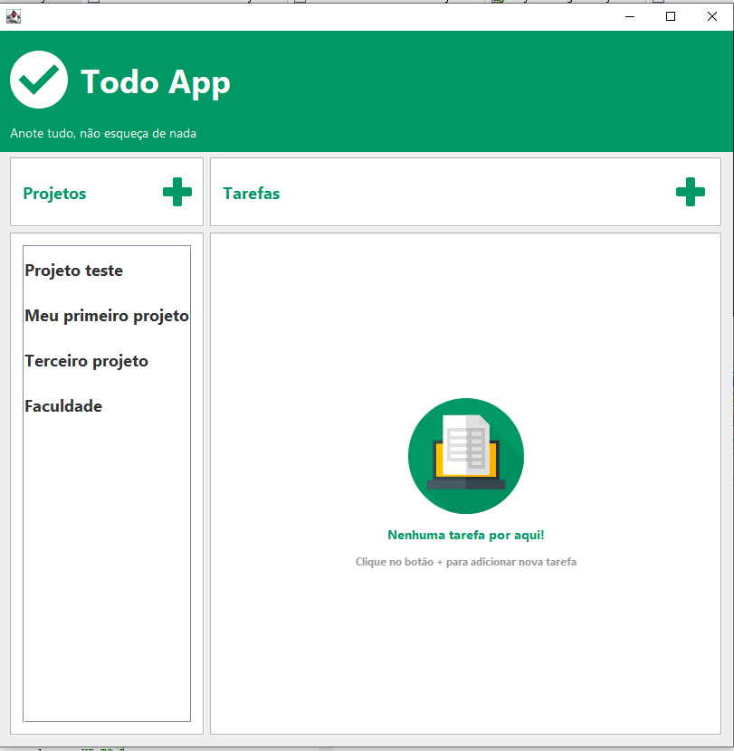
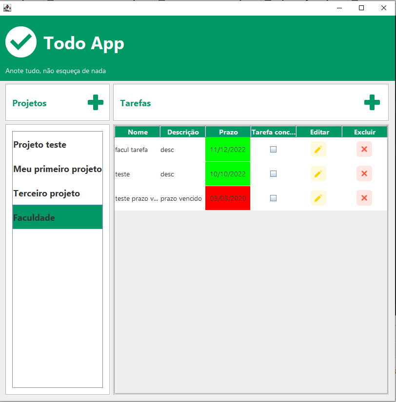
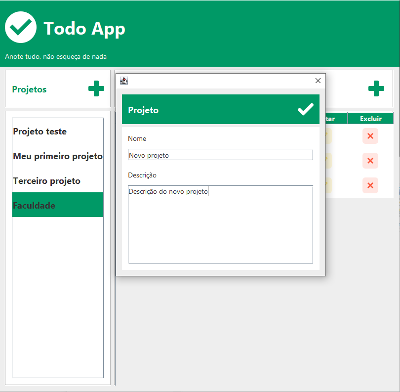
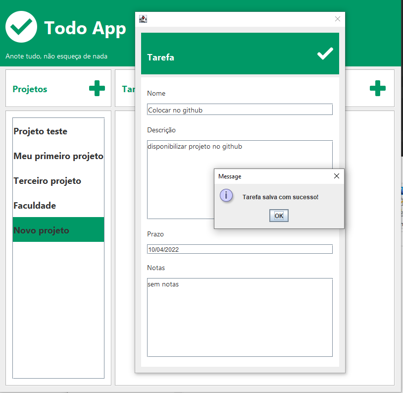

        
    
    
    

# TodoApp
Aplica��o para o gerenciamento de projetos e as tarefas envolvidas nesses projetos.

## Objetivo
Resolver a quest�o de organiza��o de tarefas de um ou v�rios projetos.

## Requisitos
* A aplica��o deve permitir criar, editar, excluir e buscar uma projeto (CRUD).

* A aplica��o deve permitir criar, editar, excluir e buscar uma tarefa (CRUD).

* A aplica��o deve permitir criar, editar, excluir e buscar uma tag (CRUD).

## Regras de neg�cio
- O sistema n�o contar� com um sistema de login.
- N�o haver� o conceito de usu�rio.
- Toda tarefa deve pertencer a uma lista.
- N�o podem haver tags repetidas numa mesma tarefa.	
- Deve ser possivel filtrar as tarefas por tag.

## Entidades

### Projeto
- Nome
- Tarefas
- Data de Cria��o
- Data de Atualiza��o

### Tarefa
- Nome
- Descri��o
- Status
- Tags
- Observa��es
- Prazo
- Data de Cria��o
- Data de Atualiza��o

### Tag
- Nome
- Cor
- Data de Cria��o
- Data de Atualiza��o

## :seedling: ? Requisitos M�nimos

Vontade de aprender.

## :rocket: Material de Refer�ncia e Tecnologias Utilizadas

O projeto foi desenvolvido utilizando as seguintes tecnologias

* Java 11
    * Java Swing
* MySQL
- Documenta��o das respectivas tecnologias. 

## ? Let's code! ?